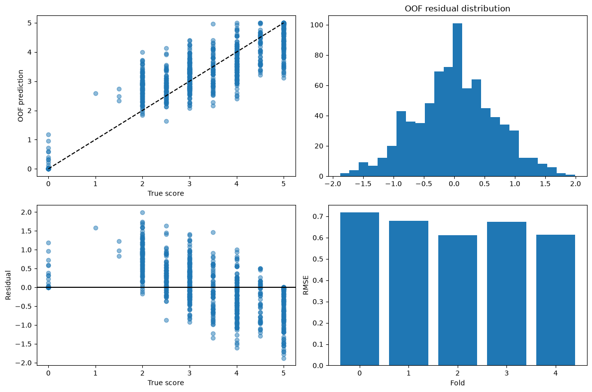
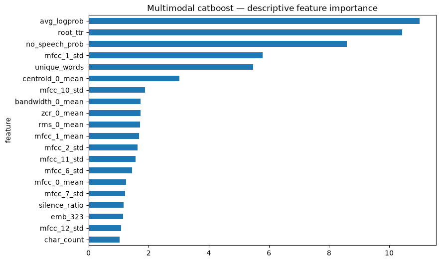

# SHL Grammar Scoring Engine — 2026

Predict continuous spoken-English grammar scores from 0 to 5 using ASR, linguistic features, frozen text embeddings, and supplementary acoustic features.

## Latest verified submission — 9 October 2026

**Kaggle public score: 0.4017**, improved from 0.4337 (original: 0.4912). Observed rank: **113**; leading score: **0.3064**. Rank #1 has not been reached.

The selected blend combines 50% WavLM-large SVR, 25% Whisper encoder SVR, and 25% of the previous ensemble. Development OOF RMSE is **0.505064** (Pearson **0.916977**); secondary-split RMSE is **0.510248** (Pearson **0.914831**). Full-fit training RMSE is **0.078528**, an in-sample result.

- [Submitted CSV](experiments/results/round3/Ronit_Mia_v3.csv)
- [Reproduction notebook](grammar_scoring_round3.ipynb)
- [Method and validation report](experiments/results/round3/report.md)
- [Verified Kaggle result](experiments/results/round3/kaggle_submission.json)

Local model selection reused development folds; the secondary split is a stability check, not an untouched holdout. Raw recordings, transcripts and intermediate features remain private.

## Latest improvement — 7 October 2026

The new candidate combines **75% Wav2Vec2 layer-6 speech-feature SVR with 25% CatBoost on richer acoustic and linguistic features**.

- Development OOF RMSE: **0.555232**; Pearson: **0.896311**.
- Secondary split RMSE: **0.554599**; Pearson: **0.896447**.
- Full-fit training RMSE: **0.077826**; Pearson: **0.998535** (in-sample).
- [New submission CSV](experiments/results/Ronit_Mia_v2.csv), [improvement notebook](grammar_scoring_improvements.ipynb), [report](experiments/results/improvement_report.md), and [reproduction instructions](experiments/README.md).

The original CSV received a public Kaggle score of **0.4912**. The new candidate was successfully submitted and scored **0.4337** (11.7% lower), with observed rank **131** on 7 October 2026. The leading score was **0.3064**; first place has not been achieved. [Submission verification](experiments/results/kaggle_submission.json). Local CV metrics are not Kaggle leaderboard scores, and no rank is guaranteed. Model selection reused development folds; the secondary split is a stability check, not an untouched holdout.

Run the original notebook first, then follow the improvement scripts linked above. Intermediate features and recordings remain private.

## Original baseline

**Selected model:** 75% CatBoost + 25% HistGradientBoosting, followed by affine calibration evaluated with nested cross-validation.

- Out-of-fold RMSE: **0.660852**
- Out-of-fold Pearson: **0.845779**
- Training RMSE: **0.366269**
- Training Pearson: **0.957219**

These are measured local results from 5-fold development CV, not Kaggle leaderboard scores. Training metrics are in-sample; choosing models on the same CV folds introduces selection optimism. Twenty-six experiments were evaluated, and eight focused regression tests passed.

## Main deliverables

- [Original complete notebook](grammar_scoring_engine.ipynb)
- [Original submission CSV — 216 predictions](artifacts/submission.csv)
- [Methodology and results report](artifacts/final_report.md)
- [Model comparison](artifacts/model_results.csv) and [fold metrics](artifacts/fold_metrics.csv)
- [Independent verification summary](artifacts/verification_summary.json)



## Pipeline

Audio → mono/16 kHz → faster-whisper ASR → lightly normalized transcript → spaCy/lexical features + chunked sentence-transformer embeddings + acoustic features → fold-fitted regression pipelines → selected blend/calibration → bounded predictions.

The executed fast configuration uses Whisper `base.en`, `all-MiniLM-L6-v2`, and all 769 training / 216 test recordings. It retains pauses and repetitions. A heavier mode offers `medium.en` and MPNet, but that mode has not been benchmarked in the recorded results.

Models compared include Ridge, ElasticNet, TF-IDF Ridge, ExtraTrees, RandomForest, HistGradientBoosting and CatBoost. XGBoost/LightGBM support is implemented but those libraries were skipped in the recorded Mac run because their native OpenMP runtime was unavailable. All data-learned transformations are fitted inside training folds. Affine calibration uses inner-fold OOF predictions, rather than leaking outer-validation labels.

## Reproduce

Use Python 3.11+ in a virtual environment. The recorded local run used Python 3.14; `requirements-lock.txt` captures that platform's exact packages. `requirements.txt` is the portable dependency list.

```bash
python3 -m venv .venv
source .venv/bin/activate
python -m pip install -r requirements.txt
python -m spacy download en_core_web_sm
export GRAMMAR_DATA_ROOT=/absolute/path/to/Dataset_Final
python run_notebook.py
```

On Windows, activate `.venv\Scripts\activate` and set the environment variable with the shell's appropriate syntax. Alternatively, open the notebook in Jupyter/Kaggle and run all cells. The notebook also discovers datasets under `/kaggle/input`, the working directory, or its parent.

Obtain data through the [official private competition](https://www.kaggle.com/competitions/shl-hiring-assessment-2026/data). No recordings, transcripts, per-record training labels, cached embeddings, or model weights are distributed here. Notebook outputs containing private examples are removed; aggregate metrics and charts remain. Public predictions contain IDs and model scores only.

First execution needs access to pretrained model weights and may take substantial CPU time. Transcripts, acoustic features and embeddings are cached for resuming. For offline execution, download the permitted pretrained weights in advance and set `GRAMMAR_ASR_MODEL` / `GRAMMAR_EMBEDDING_MODEL` to local model directories. Exact downloaded model revisions are recorded in [the manifest](artifacts/pretrained_model_manifest.json).

Set `GRAMMAR_FAST=0` to try the heavier configuration. Other feature, calibration and caching controls are in the notebook configuration cell. Optional local LanguageTool grammar checks are disabled by default and require Java.

## Submission format verification

On 6 October 2026, the official Kaggle upload dialog required **216 rows plus a header**. A fresh official `test.csv` was byte-identical to the training run's test CSV, and the submission's IDs/order match it exactly. The official `sample_submission.csv` still contained 204 mostly unrelated IDs. Accordingly, the configured export policy is `test_order`; it preserves the template's `filename,label` columns and uses all current test IDs.

The [verification record](artifacts/official_submission_verification.json) documents this check. This repository publication does not upload predictions to Kaggle or submit the SHL application form.

## Checks and generated artifacts

```bash
python test_pipeline_contracts.py
# Run after executing the notebook with authorized competition data:
python verify_run.py
```

Tests cover grouping, fold-only preprocessing, transcript preservation, pandas writable arrays, optional native-library failures and submission alignment. The verifier independently recomputes OOF/training metrics and checks CSV IDs, score bounds, folds and execution status. It needs the locally generated private artifacts, which are intentionally gitignored.

`build_notebook.py` regenerates the notebook source and clears outputs. Running the notebook may display private examples locally; do not commit those outputs. Keep the published notebook sanitized if updating this repository.

## Limitations

The dataset is small, and speaker identities are unavailable. ASR can erase grammatical errors; accent, noise, vocabulary and recording conditions can influence predictions. Confidence and acoustic features show predictive value here, but they do not directly measure grammar and may shift across datasets. The competition organizer's hidden score threshold is unknown.


